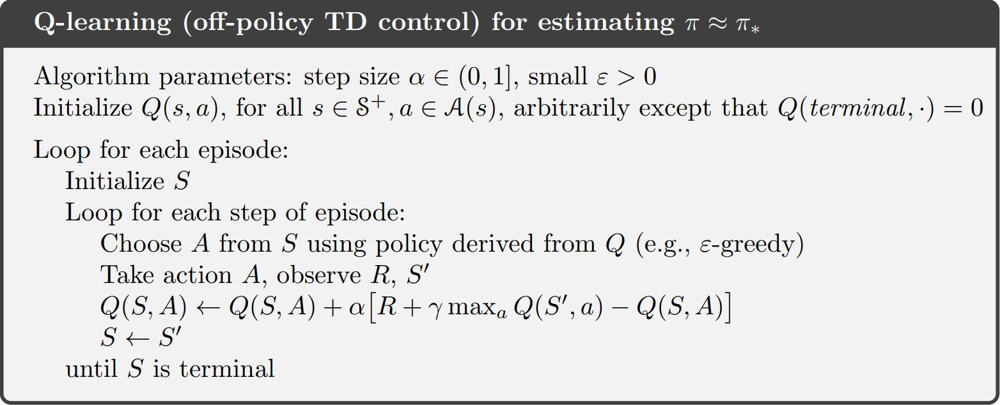

# Documentation


## Problem description

Have 8-puzzle game, where the goal is to move the tiles to the correct position.

So we have a 3x3 grid with 8 tiles and one empty space.

The tiles are numbered from `1` to `8` and the empty space is represented by `0`.

The Goal position is:
```
1|2|3
-+-+-
4|5|6
-+-+-
7|8|0
```

The tiles can be moved in four directions: up, down, left, right.

So, if we have the following starting position:
```
1|2|3
-+-+-
4|5|6
-+-+-
7|0|8
```

1. We need to move the `8` tile to `left`, so the `empty space (0 tile)` can be moved to the `right`. 
<br/>

And we will have our goal position.

## Observation Space

The observation is a tuple of 9 elements, where each element is a number from `0` to `8`.

For example, the starting position will be represented as:

```
1|2|3
-+-+-
4|5|6   ---> (1, 2, 3, 4, 5, 6, 7, 0, 8)
-+-+-
7|0|8
```

Observation space is `discrete` and has `9! = 362880` possible states.

## Action Space

The action is a number from `0` to `3`, where each number represents a `direction` to `move` the `empty space` `(0 tile)`.

- `0` - up
- `1` - down
- `2` - left
- `3` - right

Action space is `discrete` and has `4` possible actions.


## Generating a solvable 8-puzzle

To check is generated 8-puzzle is solvable, we need to count the number of inversions.

An inversion is when a tile precedes another tile with a lower number on it.

When counting the inversions, we need to ignore the `0` tile.

When count of the inversion is `even`, the puzzle is solvable. Otherwise, it is not solvable.

Example:
```
5|2|8
-+-+-
4|1|7
-+-+-
0|3|6
```

```
5 precedes 1,2,3,4 - 4 inversions
2 precedes 1 - 1 inversion
8 precedes 1,3,4,6,7 - 5 inversions
4 precedes 1,3 - 2 inversions
1 precedes none - 0 inversions
7 precedes 3,6 - 2 inversions
3 precedes none - 0 inversions
6 precedes none - 0 inversions

Total inversions = 4 + 1 + 5 + 2 + 0 + 2 + 0 + 0 = 14 (Even Number) 
So this puzzle is solvable.
```

Example of implementation:
```python
    def is_solvable(self, state):
    
        flatten = np.delete(flatten, np.where(flatten == 0))

        inversion_count = 0

        for i in range(8):
            for j in range(i + 1, 8):
                if flatten[j] > flatten[i]:
                    inversion_count += 1

        return inversion_count % 2 == 0
```
[Reference](https://math.stackexchange.com/questions/293527/how-to-check-if-a-8-puzzle-is-solvable)

## Environment Implementation Details

- The environment is implemented in eight_puzzle.py as `EightPuzzleEnv` class.

- Class have params for:
  - `limit_count_steps` - `maximum number of steps` to solve the puzzle if current count of steps is bigger than this value, then the episode is end (in method `step` will return `truncated == False`).
  By default, it is set to `10_000`.
  - `reward_type` - type of reward function. By default, it is set to `simple-penalty`. Possible values are `simple-penalty`, `manhattan`, `hamming`.
  - `render` - if True, then render the current state of the environment. By default, it is set to `False`.


- Have methods needed for training:
  - `reset` - reset the environment to the starting position.
  - `step` - take an action and return the next state, reward, done, truncated, and info.
  - `render` - render the current state of the environment. Implemented in Pygame library.
     - The Refresh rate by default is set to `60` frames per second. </br> But it can be changed by calling `env.set_refresh_rate(x)` method where `x` is the desired refresh rate.

- Reward function is implemented as `get_reward` method.
  - Have 3 types of it:
  - For each type, reward for invalid move or solved puzzle are -100 and 100 respectively.
    - "simple-penalty" 
      - for each move, the reward is `-1`
    - "manhattan"
      - for each move, computed  manhattan distance(between state and goal_state) for previous/current state and given difference between them.
      ```python
      prev_dist = manhattan_distance(prev_state, goal_state)
      curr_dist = manhattan_distance(curr_state, goal_state)
      
      diff = prev_dist - curr_dist / 100.0
      
      if curr_dist < prev_dist:
            reward = -1 + diff
        else:
            reward = -1 - diff
      ```
    - "hamming"
    - for each move, computed hamming distance(between state and goal_state) for previous/current state and given difference between them.
      ```python
      prev_dist = hamming_distance(prev_state, goal_state)
      curr_dist = hamming_distance(curr_state, goal_state)
      
      diff = prev_dist - curr_dist / 10.0
      
      if curr_dist < prev_dist:
            reward = -1 + diff
        else:
            reward = -1 - diff
      ```
## Q-Learning

- The Q-Learning algorithm is implemented in q_learning.py as `QLearning` class.

### Changes made to the original algorithm

1. Experimenting with initial Q-values (random, zeros)


#### Pseudocode:



<p align="center">Zdroj: Sutton-Barto: Reinforcement Learning, 2nd ed., 2018</p>


### Optimizations for Q-Learning

Firstly, for Q table we used numpy array with all possible states as tuple and one more 2d array with states as integers (so firstly find index in 1d array and then in 2d array) and actions.
It was not efficient, because we had to find index in 1d array with len == 362880 and the by this find value in Q-table. So had O(n) + O(1) complexity.

We changed it to dictionary with two keys - state and action. So we can find value in O(1) time.


## Experiments

### Metrics

The metrics used to evaluate the performance of the Q-learning algorithm are as follows:

1. `Average reward`
   - `np.mean(total_rewards)`
2. `Max reward`
   - `np.max(total_rewards)`
3. `Average steps`
   - `np.mean(steps)`
4. `Success rate`
   - `np.sum(np.array(self.rewards) > -2_000) / len(self.rewards)`
5. `Time taken`
   - Just to see how long it takes to train the model

### Hyperparameters

The hyperparameters used in the Q-learning algorithm are as follows:

1. `Alpha` (learning rate)
2. `Gamma` (discount factor) 
3. `Epsilon` (exploration rate) 
4. `Episodes` (count of steps needed to reach the goal)
5. `Decay Rate` (rate at which the epsilon decreases)
6. `Use Random Values` (initialize the Q-table with random values or zeros)
7. `Reward Type` (type of reward function)

Clarification:

To not stop process of exploration, epsilon is not decreased after reaching the minimum value == 0.01.

Epsilon is decreased by Decay Rate after each episode.
`epsilon = epsilon - decay_rate`

Limit count of steps is set to 10_000 == Truncated episode.

### Results


| Experiment | Alpha | Gamma | Epsilon | Decay Rate | Episodes | Use Random Values | Reward Type     | Average Reward | Max Reward | Average Steps | Success Rate | Time Taken (s) |
|------------|-------|-------|---------|------------|----------|-------------------|-----------------|----------------|------------|---------------|--------------|----------------|
| 1          | 0.1   | 0.8   | 0.8     | 0.0008     | 5000     | False             | small-penalty   | -29909.45      | 100.00     | 4001.65       | 0.40         | 378.26         |
| 2          | 0.1   | 0.9   | 0.6     | 0.0006     | 5000     | True              | manhattan       | -23393.17      | 98.02      | 3659.97       | 0.46         | 1374.45        |
| 3          | 0.1   | 0.99  | 0.5     | 0.0005     | 5000     | False             | hamming         | -20113.92      | 94.30      | 3168.08       | 0.50         | 404.33         |
| 4          | 0.2   | 0.8   | 0.5     | 0.0003     | 5000     | True              | small-penalty   | -25853.45      | 94.00      | 2868.58       | 0.55         | 265.07         |
| 5          | 0.2   | 0.9   | 0.65    | 0.0005     | 5000     | False             | manhattan       | -26705.95      | 95.05      | 2576.80       | 0.61         | 1388.19        |
| 6          | 0.2   | 0.99  | 0.4     | 0.0001     | 5000     | True              | hamming         | -25790.23      | 96.40      | 2352.75       | 0.43         | 481.88         |
| 7          | 0.3   | 0.8   | 0.5     | 0.0001     | 5000     | False             | small-penalty   | -34299.29      | 99.00      | 2432.26       | 0.33         | 366.81         |
| 8          | 0.3   | 0.9   | 0.45    | 0.0001     | 5000     | True              | manhattan       | -27708.66      | 99.01      | 2163.85       | 0.41         | 1234.35        |
| 9          | 0.3   | 0.99  | 0.4     | 0.0001     | 5000     | False             | hamming         | -23232.71      | 96.30      | 1989.20       | 0.48         | 420.01         |
| 10         | 0.4   | 0.8   | 0.5     | 0.0001     | 10000    | True              | small-penalty   | -16052.33      | 97.00      | 1222.48       | 0.68         | 437.57         |
| 11         | 0.4   | 0.9   | 0.55    | 0.0001     | 10000    | False             | manhattan       | -16059.25      | 98.02      | 1087.98       | 0.67         | 760.94         |
| 12         | 0.4   | 0.99  | 0.8     | 0.0009     | 10000    | True              | hamming         | -11113.06      | 97.30      | 998.58        | 0.87         | 249.59         |
| 13         | 0.5   | 0.8   | 0.6     | 0.0005     | 10000    | False             | small-penalty   | -10808.15      | 97.00      | 1031.22       | 0.86         | 192.76         |
| 14         | 0.5   | 0.9   | 0.45    | 0.0005     | 10000    | True              | manhattan       | -7536.99       | 98.02      | 946.37        | 0.88         | 689.36         |
| 15         | 0.5   | 0.99  | 0.4     | 0.0005     | 10000    | False             | hamming         | -6480.08       | 100.00     | 879.71        | 0.89         | 224.33         |


Based on the data from the experiments, several trends and observations can be made:

1. As the value of the Gamma hyperparameter increases, generally, the success rates improve, suggesting that placing more emphasis on future rewards can be beneficial.
2. The experiments with random values (stochastic approaches) often showed higher success rates compared to deterministic settings, indicating potential advantages in exploration strategies.
3. Higher Alpha values, which correspond to the learning rate, typically resulted in lower average steps and improved success rates, highlighting the impact of faster learning on performance.
4. The use of different reward types (small-penalty, manhattan, hamming) did not show a consistent impact on success rate across experiments, suggesting that the choice of reward type might need to be tailored to specific scenarios or further optimized.
5. There is a noticeable trend where higher Epsilon values, particularly when combined with appropriate decay rates, lead to better overall performance metrics, reinforcing the importance of exploration in the early stages of training.

### Possible Future Work

During the training/exploitation phase, found that max count of visited states is exactly half of all possible states (181440). That probably related with not solvable puzzles, so further we can check this and optimize the observation space.